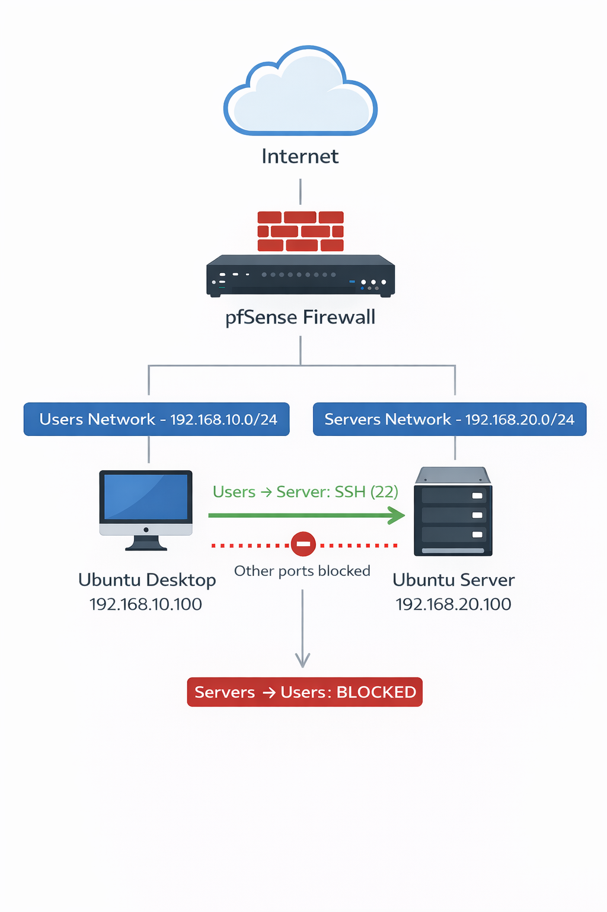

# Projet 3 — Infrastructure sécurisée avec segmentation réseau

## Objectif

Mettre en place une infrastructure segmentée et sécurisée afin de :

- réduire la surface d’attaque
- limiter les mouvements latéraux
- observer et analyser les événements de sécurité
- comprendre le rôle d’un firewall réseau dans une architecture sécurisée

L’environnement a été déployé dans un laboratoire virtualisé avec VirtualBox.

## Architecture

| Machine        | Rôle               | IP                          |
| -------------- | ------------------ | --------------------------- |
| pfSense        | Firewall / routeur | 192.168.10.1 / 192.168.20.1 |
| Ubuntu Desktop | Client utilisateur | 192.168.10.100              |
| Ubuntu Server  | Serveur cible      | 192.168.20.100              |



## Segmentation réseau

Deux réseaux logiques ont été créés :

| VLAN    | Réseau          | Description         |
| ------- | --------------- | ------------------- |
| Users   | 192.168.10.0/24 | postes utilisateurs |
| Servers | 192.168.20.0/24 | serveurs            |


Le routage entre les réseaux est assuré par pfSense.

## Règles firewall

### LAN (Users)

Autorisé :

`Users → Server : TCP 22 (SSH)`


Bloqué :

`Users → Server : tous les autres ports`


### OPT1 (Servers)

Bloqué :

`Servers → Users`


Objectif :

- empêcher un pivot si un serveur est compromis
- contenir l’attaque dans le VLAN

## Analyse de la surface d’attaque

### Scan Nmap avant filtrage
```
22/tcp open  ssh

53/tcp open  domain

80/tcp open  http
```

Les services du serveur sont entièrement visibles.

### Scan Nmap après filtrage
```
22/tcp open  ssh

999 ports filtered
```

La surface d’attaque est réduite au strict nécessaire.

## Simulation d’incident

Un scénario simple a été simulé :

1. reconnaissance réseau
2. tentative SSH invalide
3. connexion réussie
4. élévation de privilège sudo

### Timeline

```
Tentatives SSH invalides

→ connexion SSH réussie

→ ouverture session utilisateur

→ utilisation sudo
```

## Analyse des logs

Sources analysées :

- logs SSH (/var/log/auth.log)
- logs sudo
- logs firewall pfSense

Exemple d’événement :

```
Invalid user fakeuser from 192.168.10.100

Accepted publickey for maxserver from 192.168.10.100

sudo session opened for user root
```

Ces événements permettent de corréler l’activité d’un utilisateur entre plusieurs systèmes.

## Enseignements

Ce laboratoire met en évidence plusieurs principes fondamentaux :

- la segmentation réseau réduit la surface d’attaque
- un firewall stateful permet un contrôle précis des flux
- la sécurité repose sur plusieurs couches (défense en profondeur)
- la détection d’incident nécessite la corrélation de logs

## Limites du laboratoire

Plusieurs angles morts existent :

- absence de centralisation des logs
- absence d’EDR sur les endpoints
- absence de SIEM pour corrélation avancée

Ces éléments seraient nécessaires dans un environnement professionnel.

## Améliorations possibles

- centralisation des logs (ELK / Wazuh)
- IDS/IPS
- contrôle des flux sortants (egress filtering)
- proxy de sortie
- authentification SSH renforcée (MFA)

## Compétences acquises

Administration réseau :

- segmentation réseau
- configuration firewall
- routage inter-réseaux

Sécurité :

- réduction de surface d’attaque
- containment d’incident
- analyse de logs

Méthodologie :

- simulation d’attaque
- corrélation d’événements
- analyse SOC basique
